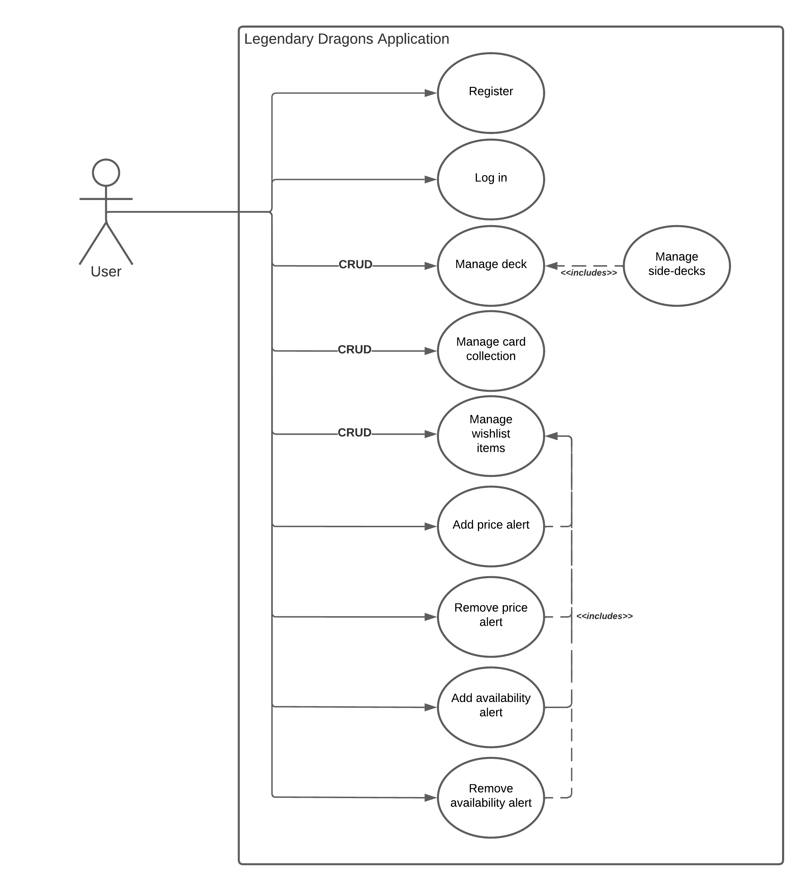

# Legendary dragons
Legendary Dragons is a Magic The Gathering collection management tool that allows users to track and organize their cards. Users can add, delete, and update cards in their collection, view detailed information about each card, and search for specific cards.  Additionally, it has a deck building feature that allows players to create and manage custom decks. It also includes a wishlist feature that allows users to keep track of cards they want to acquire. The tool is available as a web application.

# Contents

- [SonarQube Projects](#sonarqube-projects)
- [Architecture](#architecture)
- [Starting the CI/CD Pipelines](#starting-the-cicd-pipelines)
- [AWS](#aws)
- [Requirements](#requirements)

# SonarQube Projects

- [legendary-dragons-wishlist](https://sonar.cloud-native-minor.it/dashboard?id=legendary-dragons-wishlist)
- [legendary-dragons-inventory](https://sonar.cloud-native-minor.it/dashboard?id=legendary-dragons-inventory)
- [legendary-dragons-identity-and-access](https://sonar.cloud-native-minor.it/dashboard?id=legendary-dragons-identity-and-access)
- [legendary-dragons-frontend](https://sonar.cloud-native-minor.it/dashboard?id=legendary-dragons-frontend)
- [legendary-dragons-deck](https://sonar.cloud-native-minor.it/dashboard?id=legendary-dragons-deck)
- [legendary-dragons-connection](https://sonar.cloud-native-minor.it/dashboard?id=legendary-dragons-connection)
- [legendary-dragons-card](https://sonar.cloud-native-minor.it/dashboard?id=legendary-dragons-card)

# Architecture

## Use Case diagram

Within the scope of the Legendary Dragons Application, 3 actors have been identified; The `Anonymous User`, the `User` and `Scryfall (external)`.

| Actor          | Goal                      | Description                                                                                     |
|----------------|---------------------------|-------------------------------------------------------------------------------------------------|
| Anonymous User | Register                  | The anonymous user must register to start using the application                                 |
| User           | Log in                    | The user must login to start managing his card collection                                       |
| User           | Manage deck / side-decks  | The user can add & delete cards from their decks/side-decks                                     |
| User           | Manage card collection    | The user can add & delete MTG cards to their collection                                         |
| User           | Search card by keyword    | The user can search for a specific MTG card                                                     |
| User           | Manage wishlist items     | The user can add & remove cards to their wishlist                                               |
| User           | Manage price alert        | The user can add & delete the alert notification when a card has reached a specific price point |
| User           | Manage availability alert | The user can add & delete the alert notification when a card is available                       |
| Scryfall       | Search card by keyword    | Provide a collection of cards based on the keywords                                             |
| Scryfall       | Update card price         | Provide the total collection of MTG cards with updated prices                                   |

## Event Storming

## Logical View (Domain MOdel)

## Context Map

## Cloud Deployment diagram

## DynamoDB Database design
This section contains the database design for DynamoDB. The design can be imported with the tool NoSQLWorkbench
with the following file:

## REST API

## Websockets

Websocket documentation: http://websocket-documentation.s3-website-us-east-1.amazonaws.com/

## Wireframes

# Starting the CI/CD Pipelines

# AWS

# Requirements

## Functionele eisen (20%)

| Done | Requirement                                               |
|------|-----------------------------------------------------------|
| heavy_check_mark:    | [MUST] Gebruikers registratie, authenticatie, autorisatie |
| heavy_check_mark:    | [MUST] Kaart collectie beheren                            |
| heavy_check_mark:    | [MUST] Decks (EDH/Commander) beheren                      |
| heavy_check_mark:    | [MUST] Side decks beheren                                 |
| :x:    | [SHOULD] Wishlist beheren                                 |
| :x:    | [SHOULD] Actuele waarde van de collectie en decks inzien  |
| :x:    | [SHOULD] Price alert voor whishlist kaarten               |
| :x:    | [SHOULD] Availability alert voor wishlist kaarten         |

## Ontwikkelen van container- en serverless applicaties voor de Amazon Cloud (AWS) (5%)

| Done | Requirement                                           |
|------|-------------------------------------------------------|
| heavy_check_mark:    | [SHOULD] Applicatie functioneert als integraal geheel |
| heavy_check_mark:    | [SHOULD] Lambda's correct toegepast                   |
| heavy_check_mark:    | [SHOULD] WebSocket / REST principes correct toegepast |
| heavy_check_mark:    | [SHOULD] API ontwerp / OpenAPI documentatie opgesteld |
| heavy_check_mark:    | [SHOULD] Source code is goed leesbaar                 |

## Ontwikkelen van front-end applicaties deployed in de Amazon Cloud (AWS) (5%)

| Done | Requirement                                              |
|------|----------------------------------------------------------|
| heavy_check_mark:    | [SHOULD] Applicatie functioneert als integraal geheel    |
| heavy_check_mark:    | [SHOULD] CloudFront/S3 frontend deployment               |
| heavy_check_mark:    | [SHOULD] Framework (Angular/React/Vue) correct toegepast |
| heavy_check_mark:    | [SHOULD] Source code is goed leesbaar                    |
| heavy_check_mark:    | [SHOULD] Goede User Experience                           |
| heavy_check_mark:    | [COULD] Websockets gebruikt om status te synchroniseren  |

## Ontwikkelen van applicaties met SQL- en NoSQL-databases. (5%)

| Done | Requirement                                                        |
|------|--------------------------------------------------------------------|
| heavy_check_mark:    | [SHOULD] DynamoDB correct toegepast                                |
| heavy_check_mark:    | [SHOULD] Eventual consistency correct toegepast                    |
| heavy_check_mark:    | [SHOULD] Access patterns correct geïdentificeerd en toegepast      |
| :x:    | [CLOUD] Distributed transacties correct toegepast (Step Functions) |

## Toepassen van Container- en Serverless technologie voor de deployment van applicaties (5%)

| Done | Requirement                                    |
|------|------------------------------------------------|
| heavy_check_mark:    | [SHOULD] API Gateway correct toegepast         |
| heavy_check_mark:    | [SHOULD] EventBridge/SNS/SQS correct toegepast |
| heavy_check_mark:    | [SHOULD] Logging correct toegepast             |
| heavy_check_mark:    | [SHOULD] X-Ray correct toegepast               |

## Toepassen van CI, CD en Infra-as-Code voor het inrichten van applicaties in een cloudomgeving (10%)

| Done | Requirement                                                          |
|------|----------------------------------------------------------------------|
| heavy_check_mark:    | [MUST] CDK, CloudFormation en/of SAM correct toegepast               |
| heavy_check_mark:    | [MUST] CD pipeline voor de infrastructuur ingericht                  |
| heavy_check_mark:    | [MUST] Source code beschikbaar in monorepo in GitHub                 |
| heavy_check_mark:    | [MUST] CI pipeline voor de backend ingericht                         |
| heavy_check_mark:    | [MUST] CD pipeline voor de backend ingericht                         |
| :x:    | [SHOULD] OTAP principe toegepast om staging en productie te scheiden |
| heavy_check_mark:    | [COULD] CI pipeline voor de frontend ingericht                       |
| heavy_check_mark:    | [COULD] CD pipeline voor de frontend ingericht                                                                     |

## Borgen van de kwaliteit van applicaties en geautomatiseerd testen (10%)

| Done | Requirement                                                         |
|------|---------------------------------------------------------------------|
| heavy_check_mark:    | [MUST] Code reviews by peers                                        |
| heavy_check_mark:    | [MUST] Git feature branching met merge requests toegepast           |
| heavy_check_mark:    | [MUST] QA via Sonar                                                 |
| heavy_check_mark:    | [MUST] Unit-/integratie testen voor de backend                      |
| heavy_check_mark:    | [SHOULD] SonarQube Quality Gate is passed. (e.g. Codecoverage >80%) |
| heavy_check_mark:    | [SHOULD] Functionele testen voor de backend (system level)          |
| :x:    | [COULD] Functionele tests opgenomen in de CI/CD pipeline            |
| heavy_check_mark:    | [COULD] Unittest en/of Cypresstesten voor de frontend               |

## Kennis van cloud- en serverless architecturen. (10%)

| Done | Requirement                                                                  |
|------|------------------------------------------------------------------------------|
| heavy_check_mark:    | [MUST] Events, Commands en Aggregates geïdentificeerd middels Event storming |
| heavy_check_mark:    | [MUST] Domein model volgens DDD principes                                    |
| heavy_check_mark:    | [MUST] Databaseontwerp opgesteld                                             |
| heavy_check_mark:    | [MUST] Cloud deployment diagram correct opgesteld                            |
| heavy_check_mark:    | [SHOULD] Events correct toegepast                                            |
| heavy_check_mark:    | [SHOULD] Commands correct toegepast                                          |
| heavy_check_mark:    | [SHOULD] CQRS correct toegepast                                              |

## Kennis van cloudinfrastructuur, monitoring, performance, reliability, security en kosten (15%)

| Done | Requirement                                                                                           |
|------|-------------------------------------------------------------------------------------------------------|
| heavy_check_mark:    | [MUST] CloudWatch Monitoring dashboard ingericht en bijgehouden                                       |
| heavy_check_mark:    | [MUST] Authenticatie en autorisatie toegepast (AWS Cognito)                                           |
| heavy_check_mark:    | [MUST] Performance tests opgezet en regelmatig uitgevoerd                                             |
| heavy_check_mark:    | [SHOULD] IAM Roles en Permissions correct toegepast (Least priveledge)                                |
| heavy_check_mark:    | [SHOULD] SSL/TLS beveiliging toegepast op endpoints                                                   |
| heavy_check_mark:    | [SHOULD] Kosten zijn beheerst gebleven                                                                |
| :x:    | [SHOULD] Security van de applicaties is getest en bevat geen voor de handliggende OWASP top 10 issues |
| :x:    | [CLOUD] Performance testen opgenomen in de CI/CD pipeline                                             |

## Toepassen van Agile Scrum en DevOps principes (15%)

| Done | Requirement                                          |
|------|------------------------------------------------------|
| heavy_check_mark:    | [MUST] Backlog opgesteld en bijgehouden              |
| heavy_check_mark:    | [MUST] Sprint review (demo) gehouden                 |
| heavy_check_mark:    | [MUST] Sprint planning gehouden                      |
| heavy_check_mark:    | [SHOULD] Retrospective gehouden en acties uitgevoerd |
| heavy_check_mark:    | [SHOULD] Definition of Done opgesteld en toegepast   |
| heavy_check_mark:    | [SHOULD] Definition of Ready opgesteld en toegepast  |

## Open plus punten

| Done | Requirement                 |
|------|-----------------------------|
| heavy_check_mark:    | Use Case diagram            |
| heavy_check_mark:    | Context Map                 |
| heavy_check_mark:    | Wireframes                  |
| heavy_check_mark:    | GitHub Hook in Discord      |
| heavy_check_mark:    | Self-hosted runner (effort) |
