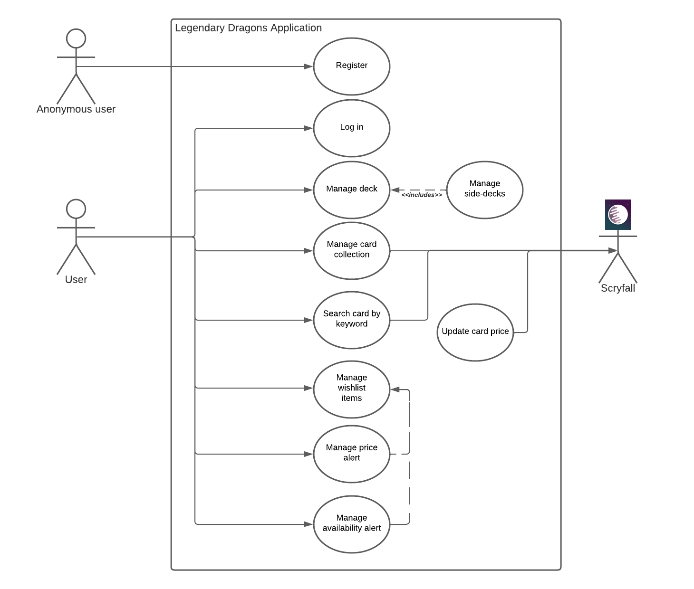
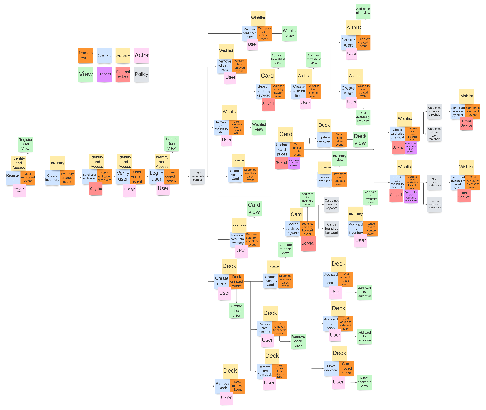
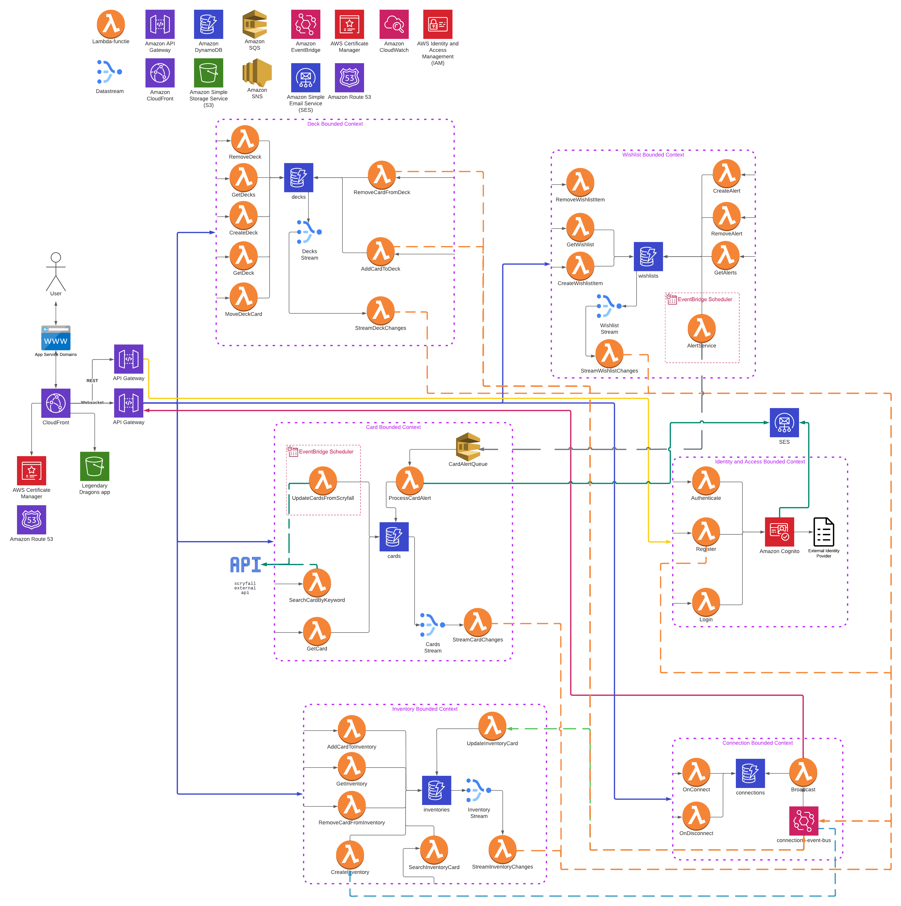
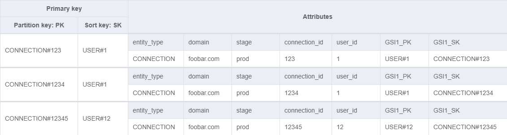
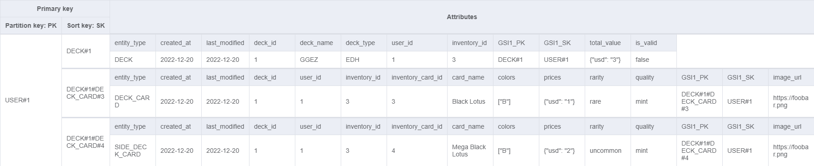
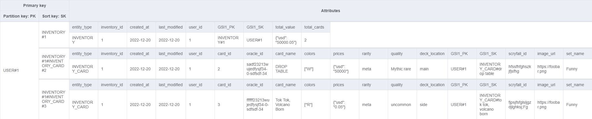
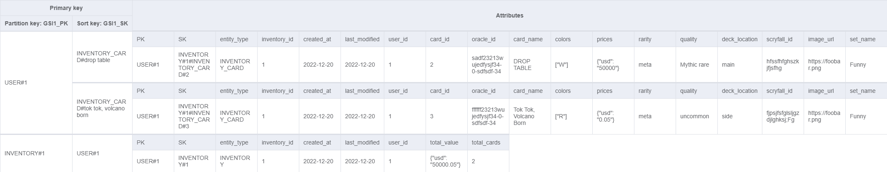
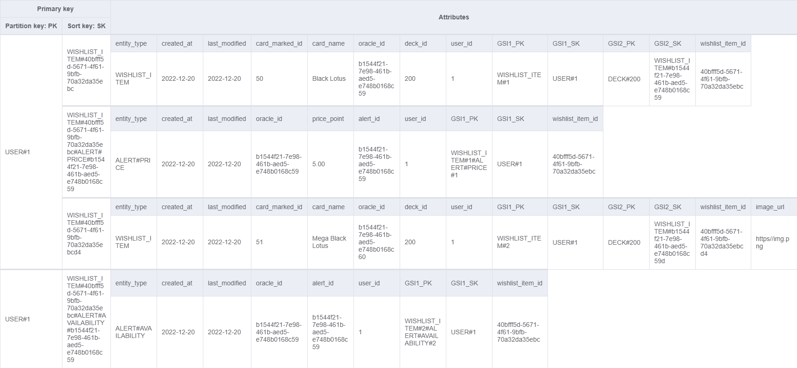
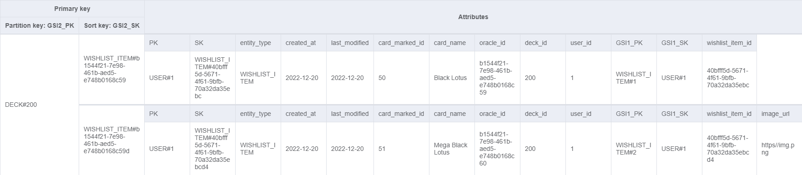
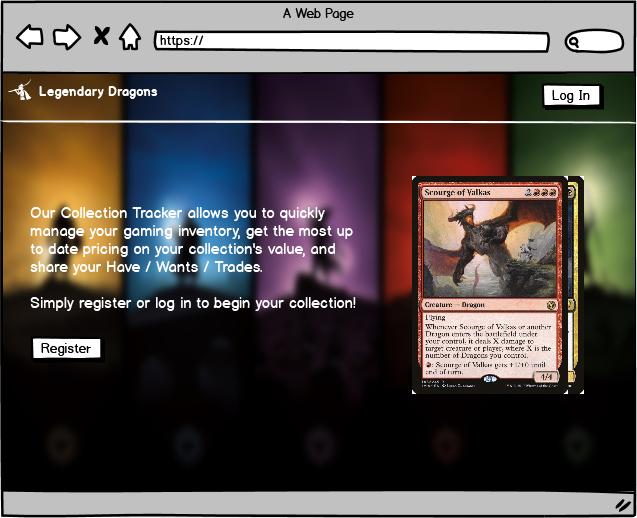

# Legendary dragons
Legendary Dragons is a Magic The Gathering collection management tool that allows users to track and organize their cards. Users can add, delete, and update cards in their collection, view detailed information about each card, and search for specific cards.  Additionally, it has a deck building feature that allows players to create and manage custom decks. It also includes a wishlist feature that allows users to keep track of cards they want to acquire. The tool is available as a web application.

# Contents

- [SonarQube Projects](#sonarqube-projects)
- [Architecture](#architecture)
- [Starting the CI/CD Pipelines](#starting-the-cicd-pipelines)
- [AWS](#aws)
- [OWASP TOP 10](#owasp-/-security)
- [Requirements](#requirements)

# SonarQube Projects

- [legendary-dragons-wishlist](https://sonar.cloud-native-minor.it/dashboard?id=legendary-dragons-wishlist)
- [legendary-dragons-inventory](https://sonar.cloud-native-minor.it/dashboard?id=legendary-dragons-inventory)
- [legendary-dragons-identity-and-access](https://sonar.cloud-native-minor.it/dashboard?id=legendary-dragons-identity-and-access)
- [legendary-dragons-frontend](https://sonar.cloud-native-minor.it/dashboard?id=legendary-dragons-frontend)
- [legendary-dragons-deck](https://sonar.cloud-native-minor.it/dashboard?id=legendary-dragons-deck)
- [legendary-dragons-connection](https://sonar.cloud-native-minor.it/dashboard?id=legendary-dragons-connection)
- [legendary-dragons-card](https://sonar.cloud-native-minor.it/dashboard?id=legendary-dragons-card)

# Architecture

## Use Case diagram

Within the scope of the Legendary Dragons Application, 3 actors have been identified; The `Anonymous User`, the `User` and `Scryfall (external)`.



| Actor          | Goal                      | Description                                                                                     |
|----------------|---------------------------|-------------------------------------------------------------------------------------------------|
| Anonymous User | Register                  | The anonymous user must register to start using the application                                 |
| User           | Log in                    | The user must login to start managing his card collection                                       |
| User           | Manage deck / side-decks  | The user can add & delete cards from their decks/side-decks                                     |
| User           | Manage card collection    | The user can add & delete MTG cards to their collection                                         |
| User           | Search card by keyword    | The user can search for a specific MTG card                                                     |
| User           | Manage wishlist items     | The user can add & remove cards to their wishlist                                               |
| User           | Manage price alert        | The user can add & delete the alert notification when a card has reached a specific price point |
| User           | Manage availability alert | The user can add & delete the alert notification when a card is available                       |
| Scryfall       | Search card by keyword    | Provide a collection of cards based on the keywords                                             |
| Scryfall       | Update card price         | Provide the total collection of MTG cards with updated prices                                   |

## Event Storming




## Logical View (Domain Model)


## Context Map


The diagram displays the various contexts withing the Legendary Dragons application. The description below describes each context:

- CardContext: The context for managing the cards from the Scryfall API.
- InventoryContext: The context for the inventory management for a user.
- DeckContext: The context for the deck management for a user.
- WishlistContext: The context for the deck management for a user.
- IdentityAndAccessContext: The context for authenticate & authorization of a user.

## Cloud Deployment diagram



## DynamoDB Database design
This section contains the database design for DynamoDB. The design can be imported with the tool NoSQLWorkbench
with the following file: [./diagrams/db/LegendaryDragons.json](./diagrams/db/LegendaryDragons.json).

The following access patterns were identified for the design:


#### Card

1) Get Card by id
```python
table.query(
    KeyConditionExpression=Key("PK").eq("CARD#asd-122343-fdff") &
    Key("SK").begins_with("CARD_FACE")
)
```
Required in:
- Inventory card detail modal
- Deck card detail modal


#### Inventory

1) Get inventory for a user
```python
table.query(
    KeyConditionExpression=Key("PK").eq("USER#1234") &
    Key("SK").begins_with("INVENTORY"),
)["Items"]
```
Required in:
- Inventory overview page

2) Inventory Cards Search
```python
table.query(
KeyConditionExpression=Key("GSI1_PK").eq(f"USER#1234") & Key("GSI1_SK").begins_with(f"INVENTORY_CARD#1"),
IndexName="GSI1",
)
```
Required in:
- Inventory overview page
- Add card to deck modal


#### Deck

1) Get Decks
```python
table.query(
    KeyConditionExpression=Key("PK").eq("USER#1234") &
    Key("SK").begins_with("DECK#"),
)["Items"]
```
Required in:
- Decks page

2) Get Deck by Id
```python
table.query(
    KeyConditionExpression=Key("PK").eq("USER#1234") &
    Key("SK").begins_with("DECK#1"),
)["Items"]
```
Required in:
- Decks details page


#### Wishlist

1) Get wishlist
```python
table.query(
    KeyConditionExpression=Key("PK").eq("USER#1234") &
    Key("SK").begins_with("WISHLIST_ITEM#"),
)["Items"]
```
Required in:
- Wishlist page

2) Get Alerts
```python
table.query(
    KeyConditionExpression=Key("PK").eq("USER#1234") &
    Key("SK").begins_with("WISHLIST_ITEM#1#ALERT#"),
)["Items"]
```
Required in:
- Wishlist item modal


### Connections



**GSI1:**


### Cards


**GSI1:**


### Decks



**GSI1:**


### Inventory



**GSI1:**


### Wishlists



**GSI1:**


**GSI2:**


## REST API
The Legendary Dragons application has one API Gateway configured as a RESTful API, which is used for register and login process for a user. The specification of the REST API can be found in the [./identity-and-access/swagger-spec.json](./identity-and-access/swagger-spec.json) file.

## Websockets
The Legendary Dragons application also has one API Gateway configured for websockets. The documentation can be read at: http://websocket-documentation.s3-website-us-east-1.amazonaws.com/. The specification can be found in the [./api-documentation/legendary_dragons_websocket.yml](./api-documentation/legendary_dragons_websocket.yml) file

## Wireframes

**Homepage**:



**Register**:


**Login**:


**Inventory**:


**Decks Mainpage**:


**Decks detail**:


**Wishlist**:


## Retrospectives


# Starting the CI/CD Pipelines

The following GitHub secrets are needed to run the pipelines and they are already configured:

* `AWS_ACCESS_KEY_ID`
* `AWS_SECRET_ACCESS_KEY`
* `DISTRIBUTION_ID`
* `SONAR_HOST_URL`
* `SONAR_TOKEN`

## Feature pipelines

The pipelines are run in GitHub Actions. When creating a pull request, a seperate workflow is used for each context
for running tests building and verifying that the application works. Also a feature workflow is used for testing
and building the application when working in a branch with the name: `feature/{branch-name}`.

A feature pipeline is configured for the following contexts:

* `Card`
* `Connection`
* `Deck`
* `Frontend`
* `Identity & Access`
* `Inventory`
* `Wishlist`

## Release pipelines

When a pull request is merged the release pipelines will be triggered.
The layered stack will build the Cognito context, the connections event bus and the websocket API gateway when there is a change made to either of these services.
The other contexts use the services which results in a layered stack. The frontend release pipeline builds the application and deploys it to a S3 Bucket.

A release pipeline is configured for the following contexts:

* `Card`
* `Connection`
* `Deck`
* `Frontend`
* `Functional and performance test`
* `Identity & Access`
* `Inventory`
* `Layered Stack`
* `Wishlist`

The `Functional and performance test` pipeline will run when a pull request is merged and if one of the pipelines above if successful, with the exception of the `Frontend` release pipeline.

# AWS
All of the infrastructure of the application is setup with Serverless Application Model (SAM) with layered stacks.

## CloudFormation Stacks
- [legendary-dragons-wishlist](https://us-east-1.console.aws.amazon.com/cloudformation/home?region=us-east-1#/stacks/stackinfo?stackId=arn%3Aaws%3Acloudformation%3Aus-east-1%3A861259332787%3Astack%2Flegendary-dragons-wishlist%2Ff6ac2630-99b9-11ed-a882-1232682a975b)
- [legendary-dragons-card](https://us-east-1.console.aws.amazon.com/cloudformation/home?region=us-east-1#/stacks/stackinfo?stackId=arn%3Aaws%3Acloudformation%3Aus-east-1%3A861259332787%3Astack%2Flegendary-dragons-card%2F7944b630-97e3-11ed-b0c4-0a0fee2a77e3)
- [legendary-dragons-deck](https://us-east-1.console.aws.amazon.com/cloudformation/home?region=us-east-1#/stacks/stackinfo?stackId=arn%3Aaws%3Acloudformation%3Aus-east-1%3A861259332787%3Astack%2Flegendary-dragons-deck%2F6077cd70-93f8-11ed-bb05-0e50ef923d43)
- [legendary-dragons-connection](https://us-east-1.console.aws.amazon.com/cloudformation/home?region=us-east-1#/stacks/stackinfo?stackId=arn%3Aaws%3Acloudformation%3Aus-east-1%3A861259332787%3Astack%2Flegendary-dragons-connection%2Fde26baa0-90d4-11ed-a996-12e04ed04423)
- [legendary-dragons-connection-event-bus](https://us-east-1.console.aws.amazon.com/cloudformation/home?region=us-east-1#/stacks/stackinfo?stackId=arn%3Aaws%3Acloudformation%3Aus-east-1%3A861259332787%3Astack%2Flegendary-dragons-connection-event-bus%2F28b126e0-90cc-11ed-9615-12a3e46dd37f)
- [legendary-dragons-inventory](https://us-east-1.console.aws.amazon.com/cloudformation/home?region=us-east-1#/stacks/stackinfo?stackId=arn%3Aaws%3Acloudformation%3Aus-east-1%3A861259332787%3Astack%2Flegendary-dragons-inventory%2Fe8d7fde0-9031-11ed-9090-129065128371)
- [legendary-dragons-identity-and-access](https://us-east-1.console.aws.amazon.com/cloudformation/home?region=us-east-1#/stacks/stackinfo?stackId=arn%3Aaws%3Acloudformation%3Aus-east-1%3A861259332787%3Astack%2Flegendary-dragons-identity-and-access%2Ffa13f550-822b-11ed-adc9-0e8d6118be6f)
- [legendary-dragons-cognito](https://us-east-1.console.aws.amazon.com/cloudformation/home?region=us-east-1#/stacks/stackinfo?stackId=arn%3Aaws%3Acloudformation%3Aus-east-1%3A861259332787%3Astack%2Flegendary-dragons-cognito%2F80f36a00-8156-11ed-81c9-1201435d387f)
- [legendary-dragons-frontend](https://us-east-1.console.aws.amazon.com/cloudformation/home?region=us-east-1#/stacks/stackinfo?stackId=arn%3Aaws%3Acloudformation%3Aus-east-1%3A861259332787%3Astack%2Flegendary-dragons-frontend%2F10f06ba0-8128-11ed-b0e4-0efa1bbdbc6b)
- [legendary-dragons-ws-api-gateway](https://us-east-1.console.aws.amazon.com/cloudformation/home?region=us-east-1#/stacks/stackinfo?stackId=arn%3Aaws%3Acloudformation%3Aus-east-1%3A861259332787%3Astack%2Flegendary-dragons-ws-api-gateway%2F6196ee40-810e-11ed-b00e-0ea4e0e637e5)

## CloudFront

- [Legendary Dragons Production](https://www.legendarydragons.cloud-native-minor.it)

- [CloudFront Distrubtion](https://us-east-1.console.aws.amazon.com/cloudfront/v3/home?region=us-east-1#/distributions/E2NYU2TQVP1L0T)

## EC2
An EC2 instance was created to for the attempt of a self hosted GitHub runner. The instance is shutdown, but can be found [here](https://us-east-1.console.aws.amazon.com/ec2/home?region=us-east-1#InstanceDetails:instanceId=i-0948197efb73a1287)

# OWASP / Security

Here, we will test and document the 10 most important security risks in our application.

## 1. Injection

We use input validation where necessary. Input validation is an important step in preventing injection attacks.
To prevent SQL injection, we use parameterized queries with DynamoDB. The values are passed as parameters to the query and are not directly integrated into the query. This makes it more difficult for hackers to insert dangerous instructions, as they are not directly integrated into the query. See an example below where a card is retrieved by its ID:
```
table.update_item(
      Key={
        "PK": pk,
        "SK": sk
      },
      ConditionExpression='attribute_exists(PK) AND attribute_exists(SK)',
      UpdateExpression='set total_value = :new_total_values',
      ExpressionAttributeValues={
        ":new_total_values": new_total_values
      }
  )
)
```

## 2.  Authentication errors
* We use strong password policy and do not use hard-coded passwords.
* We use 2FA (two-factor authentication). 2FA is an additional security layer added to the traditional password-based authentication process. Instead of using just a password, 2FA requires a user to use two different factors to log in:
* A verification email that is sent to the email address used during the registration process.

## 3.  Sensitive data
* We use the AWS Cognito service which provides encryption. This means that sensitive information such as user passwords are encrypted.
To limit this risk, it is important to restrict access to management interfaces to only authorized users. This can be done through authentication and authorization controls, such as 2-factor authentication and role-based access policy.
* We use a verification email.

## 4.  Failing access controls
* To limit this risk, it is important to restrict access to management interfaces to only authorized users. This can be done through authentication and authorization controls, such as 2-factor authentication and role-based access policy.
* We use a verification email.

## 5.  Incorrect configuration
* A way to prevent security mistakes in architecture and design is by applying input and output validation. Input validation means checking the input data for validity and suitability for the specific purpose they are used for. This prevents users from entering invalid or dangerous data. Output validation means checking the output of an application for validity and suitability for the specific situation it is used in. This prevents users from receiving dangerous or invalid data. And this is implemented in our implementation.

## 6.  Insufficient security of communication channels
* We use AWS API Gateway. AWS API Gateway is a service that can be used to create, publish, secure, and manage APIs. With API Gateway, you can secure APIs using SSL/TLS encryption. For example, you can upload a certificate to the service and then configure all traffic to the API to go through HTTPS. This encrypts all data sent to and from the API with SSL/TLS.

## 7. Incorrect management of changes and configurations
* A way to limit this risk is by using automation for application change management.
* Automation is the process of implementing systems and software that can automate repetitive manual tasks, such as implementing changes and configurations. This allows for more efficient work and can reduce errors. We do this through GitHub actions pipelines.

## 8.  Insufficient data security
* A way to limit this risk is by using access control to restrict data access to only those users who have permission. Access control is a process of setting rules for who has access to which data and for what purposes. This allows for monitoring of who has access to which data and how this data is used.
* For this, we use AWS Identity and Access Management (IAM) in our application.

## 9.  Insufficient security of software dependencies
* A way to limit this risk is by keeping dependencies up-to-date and regularly checking them for security issues. It is important to use the latest versions of dependencies as they often fix security issues that were present in previous versions.
* In our implementation, we primarily use LTS (Long-Term Support) versions of software which have resolved issues and security problems.

## 10.  Insufficient logging and monitoring
* A way to limit this risk is by using logging and monitoring. Logging is the process of recording data about activities within an application. Monitoring is the process of monitoring this data in real-time to quickly identify problems. This allows for quick action to be taken if a security issue is found.

* Our application has a good logging and monitoring strategy.

* We use AWS X-Ray for logging of AWS services such as AWS Lambda, EC2 and S3.

* We use AWS CloudWatch to monitor our application.

* Additionally, we have set up an AWS dashboard which allows us to monitor and manage the usage of the AWS resources used. This allows us to map and visualize the performance of our application in real-time through various charts and data.

# Requirements

* :heavy_check_mark: = Done
* :heavy_plus_sign: = Partially done
* :x: = Not started

## Functionele eisen (20%)

| Done | Requirement                                                                |
|------|----------------------------------------------------------------------------|
| :heavy_check_mark:    | [MUST] Gebruikers registratie, authenticatie, autorisatie |
| :heavy_check_mark:    | [MUST] Kaart collectie beheren                            |
| :heavy_check_mark:    | [MUST] Decks (EDH/Commander) beheren                      |
| :heavy_check_mark:    | [MUST] Side decks beheren                                 |
| :heavy_check_mark:    | [SHOULD] Wishlist beheren                                 |
| :heavy_plus_sign:    | [SHOULD] Actuele waarde van de collectie en decks inzien   |
| :heavy_check_mark:    | [SHOULD] Price alert voor whishlist kaarten               |
| :heavy_check_mark:    | [SHOULD] Availability alert voor wishlist kaarten         |

## Ontwikkelen van container- en serverless applicaties voor de Amazon Cloud (AWS) (5%)

| Done | Requirement                                                            |
|------|------------------------------------------------------------------------|
| :heavy_check_mark:    | [SHOULD] Applicatie functioneert als integraal geheel |
| :heavy_check_mark:    | [SHOULD] Lambda's correct toegepast                   |
| :heavy_check_mark:    | [SHOULD] WebSocket / REST principes correct toegepast |
| :heavy_check_mark:    | [SHOULD] API ontwerp / OpenAPI documentatie opgesteld |
| :heavy_check_mark:    | [SHOULD] Source code is goed leesbaar                 |

## Ontwikkelen van front-end applicaties deployed in de Amazon Cloud (AWS) (5%)

| Done | Requirement                                                               |
|------|---------------------------------------------------------------------------|
| :heavy_check_mark:    | [SHOULD] Applicatie functioneert als integraal geheel    |
| :heavy_check_mark:    | [SHOULD] CloudFront/S3 frontend deployment               |
| :heavy_check_mark:    | [SHOULD] Framework (Angular/React/Vue) correct toegepast |
| :heavy_check_mark:    | [SHOULD] Source code is goed leesbaar                    |
| :heavy_check_mark:    | [SHOULD] Goede User Experience                           |
| :heavy_check_mark:    | [COULD] Websockets gebruikt om status te synchroniseren  |

## Ontwikkelen van applicaties met SQL- en NoSQL-databases. (5%)

| Done | Requirement                                                                         |
|------|-------------------------------------------------------------------------------------|
| :heavy_check_mark:    | [SHOULD] DynamoDB correct toegepast                                |
| :heavy_check_mark:    | [SHOULD] Eventual consistency correct toegepast                    |
| :heavy_check_mark:    | [SHOULD] Access patterns correct geïdentificeerd en toegepast      |
| :x:    | [COULD] Distributed transacties correct toegepast (Step Functions)                |

## Toepassen van Container- en Serverless technologie voor de deployment van applicaties (5%)

| Done | Requirement                                                     |
|------|-----------------------------------------------------------------|
| :heavy_check_mark:    | [SHOULD] API Gateway correct toegepast         |
| :heavy_check_mark:    | [SHOULD] EventBridge/SNS/SQS correct toegepast |
| :heavy_check_mark:    | [SHOULD] Logging correct toegepast             |
| :heavy_check_mark:    | [SHOULD] X-Ray correct toegepast               |

## Toepassen van CI, CD en Infra-as-Code voor het inrichten van applicaties in een cloudomgeving (10%)

| Done | Requirement                                                                           |
|------|---------------------------------------------------------------------------------------|
| :heavy_check_mark:    | [MUST] CDK, CloudFormation en/of SAM correct toegepast               |
| :heavy_check_mark:    | [MUST] CD pipeline voor de infrastructuur ingericht                  |
| :heavy_check_mark:    | [MUST] Source code beschikbaar in monorepo in GitHub                 |
| :heavy_check_mark:    | [MUST] CI pipeline voor de backend ingericht                         |
| :heavy_check_mark:    | [MUST] CD pipeline voor de backend ingericht                         |
| :x:    | [SHOULD] OTAP principe toegepast om staging en productie te scheiden                |
| :heavy_check_mark:    | [COULD] CI pipeline voor de frontend ingericht                       |
| :heavy_check_mark:    | [COULD] CD pipeline voor de frontend ingericht                       |

## Borgen van de kwaliteit van applicaties en geautomatiseerd testen (10%)

| Done | Requirement                                                                          |
|------|--------------------------------------------------------------------------------------|
| :heavy_check_mark:    | [MUST] Code reviews by peers                                        |
| :heavy_check_mark:    | [MUST] Git feature branching met merge requests toegepast           |
| :heavy_check_mark:    | [MUST] QA via Sonar                                                 |
| :heavy_check_mark:    | [MUST] Unit-/integratie testen voor de backend                      |
| :heavy_check_mark:    | [SHOULD] SonarQube Quality Gate is passed. (e.g. Codecoverage >80%) |
| :heavy_check_mark:    | [SHOULD] Functionele testen voor de backend (system level)          |
| :heavy_check_mark:    | [COULD] Functionele tests opgenomen in de CI/CD pipeline            |
| :heavy_check_mark:    | [COULD] Unittest en/of Cypresstesten voor de frontend               |

## Kennis van cloud- en serverless architecturen. (10%)

| Done | Requirement                                                                                   |
|------|-----------------------------------------------------------------------------------------------|
| :heavy_check_mark:    | [MUST] Events, Commands en Aggregates geïdentificeerd middels Event storming |
| :heavy_check_mark:    | [MUST] Domein model volgens DDD principes                                    |
| :heavy_check_mark:    | [MUST] Databaseontwerp opgesteld                                             |
| :heavy_check_mark:    | [MUST] Cloud deployment diagram correct opgesteld                            |
| :heavy_check_mark:    | [SHOULD] Events correct toegepast                                            |
| :heavy_check_mark:    | [SHOULD] Commands correct toegepast                                          |
| :heavy_check_mark:    | [SHOULD] CQRS correct toegepast                                              |

## Kennis van cloudinfrastructuur, monitoring, performance, reliability, security en kosten (15%)

| Done | Requirement                                                                                                            |
|------|------------------------------------------------------------------------------------------------------------------------|
| :heavy_check_mark:    | [MUST] CloudWatch Monitoring dashboard ingericht en bijgehouden                                       |
| :heavy_check_mark:    | [MUST] Authenticatie en autorisatie toegepast (AWS Cognito)                                           |
| :heavy_check_mark:    | [MUST] Performance tests opgezet en regelmatig uitgevoerd                                             |
| :heavy_check_mark:    | [SHOULD] IAM Roles en Permissions correct toegepast (Least priveledge)                                |
| :heavy_check_mark:    | [SHOULD] SSL/TLS beveiliging toegepast op endpoints                                                   |
| :heavy_check_mark:    | [SHOULD] Kosten zijn beheerst gebleven                                                                |
| :heavy_check_mark:    | [SHOULD] Security van de applicaties is getest en bevat geen voor de handliggende OWASP top 10 issues |
| :heavy_check_mark:    | [COULD] Performance testen opgenomen in de CI/CD pipeline                                             |

## Toepassen van Agile Scrum en DevOps principes (15%)

| Done | Requirement                                                           |
|------|-----------------------------------------------------------------------|
| :heavy_check_mark:    | [MUST] Backlog opgesteld en bijgehouden              |
| :heavy_check_mark:    | [MUST] Sprint review (demo) gehouden                 |
| :heavy_check_mark:    | [MUST] Sprint planning gehouden                      |
| :heavy_check_mark:    | [SHOULD] Retrospective gehouden en acties uitgevoerd |
| :heavy_check_mark:    | [SHOULD] Definition of Done opgesteld en toegepast   |
| :heavy_check_mark:    | [SHOULD] Definition of Ready opgesteld en toegepast  |

## Open plus punten

| Done | Requirement                                  |
|------|----------------------------------------------|
| :heavy_check_mark:    | Use Case diagram            |
| :heavy_check_mark:    | Context Map                 |
| :heavy_check_mark:    | Wireframes                  |
| :heavy_check_mark:    | GitHub Hook in Discord      |
| :heavy_check_mark:    | Self-hosted runner (effort) |
